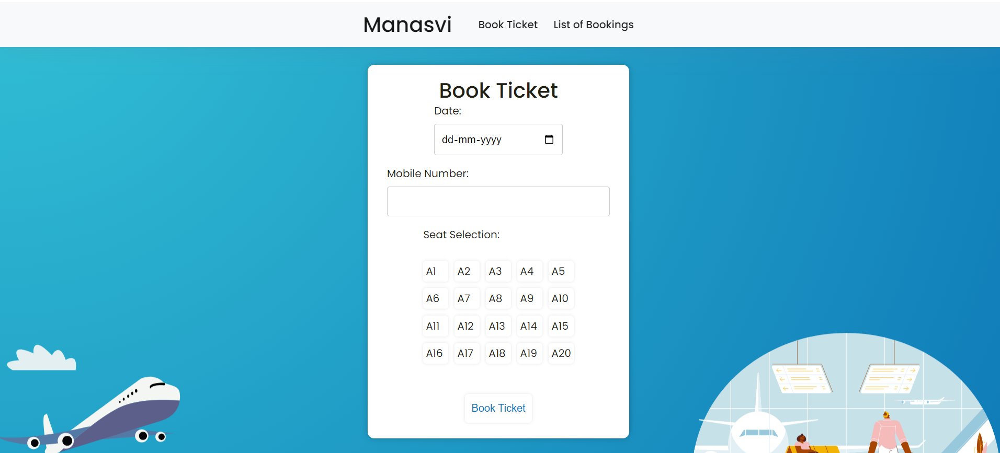
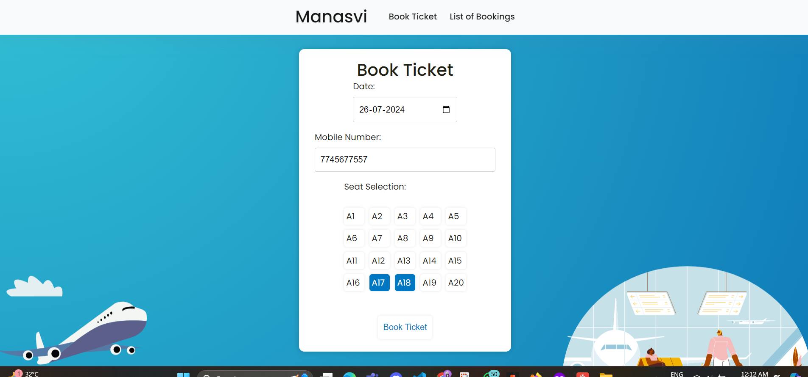
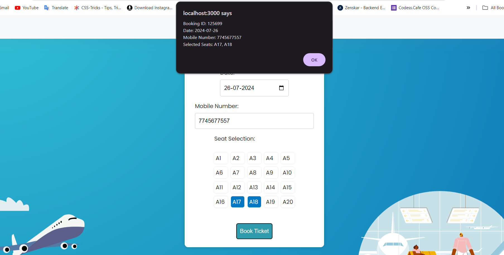
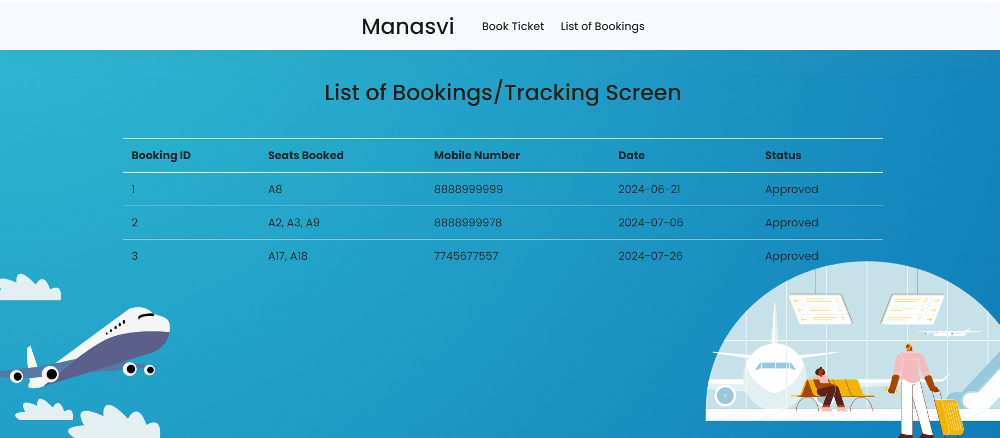

# Flight Booking System

This repository contains a flight booking system built with ReactJS. The system allows users to book tickets for specific dates flights, and manage their bookings.

## Screenshots

### Dashboard


Description: This screenshot shows the dashboard of the flight booking system where users can view available flights and search for specific routes.

### Flight Search Results


Description: This screenshot displays the search results after entering flight details, including available flights, prices, and timings.

### Booking Process


Description: This screenshot illustrates the booking process where users can select flights, enter passenger details, and proceed to payment.

### Booking Confirmation


Description: This screenshot confirms the successful booking of a flight, displaying booking details and confirmation number.

## Installation

To run this project locally, follow these steps:

1. Clone the repository:
   ```bash
   git clone https://github.com/manasvi83/Booking.git
   cd <repo-name>
2. Install dependencies:

```bash
   npm install
```
3.Start the development server:

```bash

    npm start
```
4. Open your browser and navigate to http://localhost:3000 to view the application.

## Technologies Used
   ReactJS 
   CSS 
   
## Contributing
Contributions are welcome! If you'd like to contribute to this project, please fork the repository and create a pull request.
